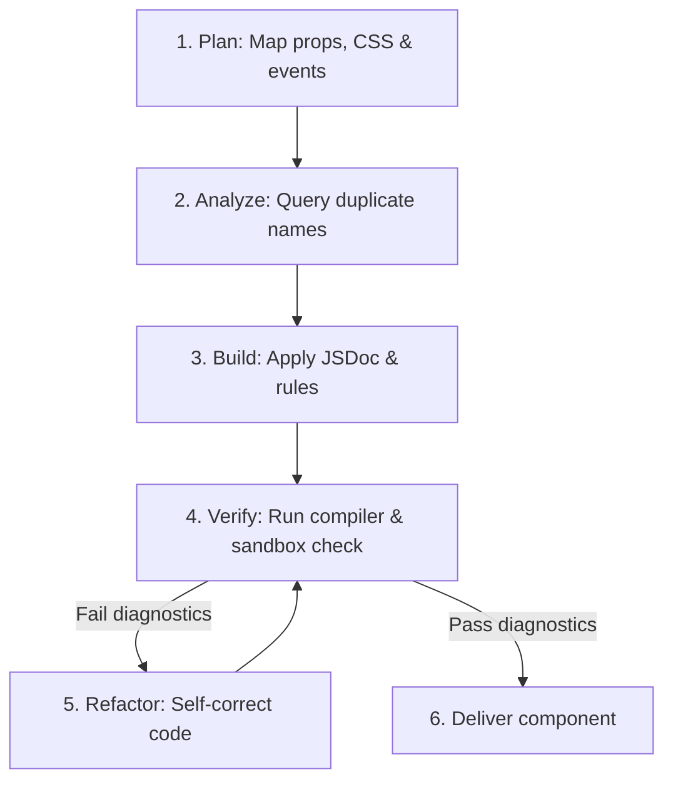

# Atomico Web Components Core Guide

Comprehensive reference for creating standard Custom Elements using Atomico's functional API.

## 1. The Core Pattern

```tsx
import { c, css, useProp, useListener } from "atomico";

/**
 * @component MyCounter
 * @see rules/component-creation.md - c(render, config) structure
 * @see rules/jsx-patterns.md - Composition using constructor tags
 */
export const MyCounter = c(
    ({ message }) => {
        /** @see rules/state-management.md - useProp for public reactive state */
        const [counter, setCounter] = useProp("counter");

        /** @see rules/hooks-api.md - useListener for clean DOM subscriptions */
        useListener({ current: window }, "resize", () => {
            console.log("Window resized! Current counter:", counter);
        });

        return (
            /** @see rules/styling-application.md - <host shadowDom> scopes styles */
            <host shadowDom>
                <h1>{message}</h1>
                <p>{counter}</p>
                {/* Event attributes use lowercase DOM casing exclusively */}
                <button onclick={() => setCounter((prev = 0) => prev + 1)}>
                    Add
                </button>
            </host>
        );
    },
    {
        /** @see rules/props-declaration.md - Props schema definition */
        props: {
            message: String,
            counter: { type: Number, value: () => 0, reflect: true }
        },
        styles: css`
            :host { display: block; color: var(--color-base, blue); }
            :host([counter="0"]) { color: red; }
        `
    }
);

/** @rule avoid-duplicate-registration - Always define components directly without conditional wrappers in source files */
customElements.define("my-counter", MyCounter);
```

## 2. Core Validation Rules (Checklist)

1. **Avoid Local Duplicates**: Before writing any file or custom element, query the workspace to ensure neither the file name (e.g. `tooltip.tsx`) nor the custom element tag name (e.g. `ui-tooltip`) is already occupied. Reuse existing elements or select a unique non-conflicting name.
2. **Root Element `<host>`**: Every render function MUST return a single `<host>` root element. Returning a `<div>`, `<Fragment>`, or other tag as the root is a fatal error.
3. **State Management**: Use `useProp` for values bound to properties or attributes that are accessible from the outside. Use `useState` strictly for internal/private ephemeral state.
4. **Event Handler Casing**: Use strictly lowercase attributes for JSX event bindings (e.g., `onclick={...}`, `onchange={...}`). Do not use React-style camelCase (`onClick`).
5. **Prop Reflection Restrictions**: Setting `reflect: true` is allowed exclusively for simple serializable types (`String`, `Number`, `Boolean`). Do not reflect `Object` or `Array` types.
6. **JSX Composition**: Always compose child components using their exported constructor instances (e.g. `<MyChild />`) rather than string tag names (e.g. `<my-child />`) to inherit full TypeScript typings.

## 3. Directory Index

- `rules/component-creation.md`: The `c()` function, JSX `<host>`, and exporting.
- `rules/jsx-patterns.md`: Using Constructors vs string tags.
- `rules/props-declaration.md`: Types, `reflect: true`, default factories, events, and callbacks.
- `rules/styling-application.md`: `<host shadowDom>` and CSS variables.
- `rules/state-management.md`: `useProp` vs `useState`.
- `examples/`: Reference implementations (Todo list, async suspense, slots, context, forms, DOM, abort controller).

## 4. API & Hooks Cheat Sheet

All React-equivalent hooks (`useState`, `useEffect`, `useLayoutEffect`, `useMemo`, `useCallback`, `useRef`, `useId`) have signatures and dependency-array semantics **exactly identical to React**.

### Core & Custom hooks
| API / Hook | Signature / Usage | Context & Rules | Reference Example |
| :--- | :--- | :--- | :--- |
| `c(render, config)` | `c((props) => JSX, config)` | Creates custom element constructor | [examples/1-generic.md](examples/1-generic.md) |
| `event<Detail>(opts?)` | `action: event<{ id: number }>({ bubbles: true })` | Inside `props` config. Generates event emitter | [examples/2-todo-app.md](examples/2-todo-app.md) |
| `callback<Fn>()` | `filter: callback<(val: string) => void>()` | Inside `props` config. Delegated logic returning values | [examples/2-todo-app.md](examples/2-todo-app.md) |
| `css` | `css` :host { ... }`` | Tagged template literal for scoped shadow CSS | [examples/1-generic.md](examples/1-generic.md) |
| `useProp(name)` | `[val, setVal] = useProp<T>("propName")` | Linked to declared prop. Throws runtime error if missing from config | [examples/1-generic.md](examples/1-generic.md) |
| `useHost()` | `host = useHost()` | Returns `{ current: HTMLElement }` instance reference | [examples/6-other-hooks.md](examples/6-other-hooks.md) |
| `useEvent(name, opts)` | `dispatch = useEvent<Detail>(name, opts)` | Dispatches `CustomEvent`. Defaults to event prop if declared | [examples/2-todo-app.md](examples/2-todo-app.md) |
| `useUpdate()` | `update = useUpdate()` | Manually triggers component re-render | [examples/6-other-hooks.md](examples/6-other-hooks.md) |
| `useListener(ref, type, cb, opts?)` | `useListener(ref, "click", (e) => {})` | Subscribes listener to ref'd element; auto-cleans on unmount | [examples/6-other-hooks.md](examples/6-other-hooks.md) |
| `useState(init)` | `[state, setState] = useState(init)` | 🔄 Identical to React. For private state only | [examples/1-generic.md](examples/1-generic.md) |
| `useCallback(fn, deps)` | `cb = useCallback(fn, deps)` | 🔄 Identical to React. Caches callback reference | [examples/6-other-hooks.md](examples/6-other-hooks.md) |
| `useMemo(fn, deps)` | `val = useMemo(fn, deps)` | 🔄 Identical to React. Caches calculated value | [examples/6-other-hooks.md](examples/6-other-hooks.md) |
| `useEffect(fn, deps)` | `useEffect(() => cleanup, deps)` | 🔄 Identical to React. Triggers async after paint | [examples/6-other-hooks.md](examples/6-other-hooks.md) |

### Async & Suspension hooks
| Hook | Signature | Behavior | Reference Example |
| :--- | :--- | :--- | :--- |
| `usePromise(cb, deps?, run?)` | `promise = usePromise(asyncFn, [id])` | Tracks async lifecycle: returns `{ result, pending, fulfilled, rejected }` | [examples/3-async-suspense.md](examples/3-async-suspense.md) |
| `useAsync(cb, deps)` | `result = useAsync(asyncFn, [id])` | Suspends rendering until promise resolves. Requires `useSuspense` parent | [examples/3-async-suspense.md](examples/3-async-suspense.md) |
| `useSuspense(fps?)` | `status = useSuspense()` | Aggregate loader boundary. Subtree `useAsync` calls propagate to it | [examples/3-async-suspense.md](examples/3-async-suspense.md) |
| `useAbortController(deps)` | `controller = useAbortController(deps)` | Auto-aborted on dependency change or component unmount | [examples/9-abort-controller.md](examples/9-abort-controller.md) |

### DOM & Context hooks
| Hook | Signature | Behavior | Reference Example |
| :--- | :--- | :--- | :--- |
| `useSlot(ref, filter?)` | `slots = useSlot(ref, el => el instanceof MyItem)` | Tracks assigned elements inside `<slot>` | [examples/8-advanced-dom.md](examples/8-advanced-dom.md) |
| `useNodes(filter?)` | `nodes = useNodes(el => el instanceof Element)` | Direct Light DOM children observer via MutationObserver | [examples/8-advanced-dom.md](examples/8-advanced-dom.md) |
| `useParent(target, cross?)` | `formRef = useParent("form", true)` | Traverses ancestors. Set `cross=true` to cross shadow boundary | [examples/8-advanced-dom.md](examples/8-advanced-dom.md) |
| `useRender(view, deps)` | `useRender(() => <button>Light DOM</button>)` | Renders VNode directly into the Light DOM | [examples/8-advanced-dom.md](examples/8-advanced-dom.md) |

### Form-Associated hooks
*Required `form: true` in component configuration.*
| Hook | Signature | Behavior | Reference Example |
| :--- | :--- | :--- | :--- |
| `useInternals()` | `internals = useInternals()` | Direct access to the native `ElementInternals` instance | [examples/7-form-association.md](examples/7-form-association.md) |
| `useFormProps()` | `[val, setVal] = useFormProps()` | Auto-syncs `name` & `value` properties with `FormData` | [examples/7-form-association.md](examples/7-form-association.md) |
| `useFormValidity(cb, deps)` | `[msg, validity] = useFormValidity(check, deps)` | Integrates native browser constraint validation | [examples/7-form-association.md](examples/7-form-association.md) |

## 5. Development & Verification Pipeline (The Sandbox Flow)

To match premium quality standards, every AI Agent MUST follow this validation pipeline when developing or refactoring Atomico components:



### Steps Description:
1. **Plan**: Draft the component shape (input props, reflected attributes, custom event types, internal styling).
2. **Analyze**: Check the workspace files and Custom Element tags to prevent naming collisions.
3. **Build**: Code the custom element strictly following the [Core Validation Rules Checklist](#2-core-validation-rules-checklist) and reference rules via inline JSDoc comments.
4. **Verify & Refactor**: Self-evaluate the code against these sandbox assertions:
   * Is `<host>` returned at the root?
   * Are events lowercase in JSX (`onclick`)?
   * If a prop is reflected, is its type serializable?
   * If `useProp` is used, is it properly declared under `config.props`?
   * If errors or gaps are detected, refactor immediately before completing the task.
