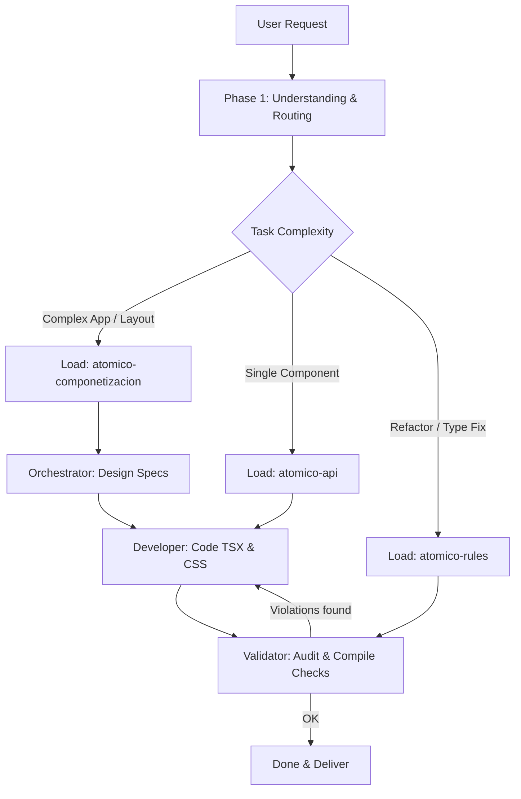

# Atomico Agentic Workflow Router (Entry-Point Skill)

This skill coordinates the overall multi-agent workflow for designing, building, and validating Atomico web components. It routes tasks to specialized phases and system prompts.

## 1. The Multi-Agent Workflow

For any Atomico request, the agent must evaluate the complexity and dispatch work using the following sequence of roles:

---

## 2. Phase Guidelines

### Phase 1: Understanding & Routing
Identify the user's core intent:
*   **Creating a Web App / Dashboard / Complex Layout**: Activate the **Orchestrator** role. Read guidelines from `atomico-componetizacion` to plan the component tree and avoid giant monolithic files.
*   **Creating a Single UI Component**: Activate the **Developer** role directly. Read guidelines from `atomico-api` to build it using the hooks matrix.
*   **Refactoring / Fix compilation**: Activate the **Validator** role first. Read guidelines from `atomico-rules` to audit the existing code, then apply fixes.

### Phase 2: Componentization (Orchestration)
*   **Objective**: Modular layout planning.
*   **Reference**: `skills/atomico-componetizacion/SKILL.md`
*   **Task**: Split views into folders (e.g. `components/`), check the workspace for existing variants to reuse, and output detailed component interface specs.

### Phase 3: Development (API & Syntax)
*   **Objective**: Standard component implementation.
*   **Reference**: `skills/atomico-api/SKILL.md`
*   **Task**: Use proper `props` default factories, explicit typings, lowercase JSX event properties, and correct state bindings (`useObjectState` for grouped states).

### Phase 4: Validation (Rules Audit)
*   **Objective**: Quality assurance and TypeScript check.
*   **Reference**: `skills/atomico-rules/SKILL.md`
*   **Task**: Enforce zero `any` declarations, parameter destructuring for read-only properties, safety checks for references, and run TypeScript validation commands.
