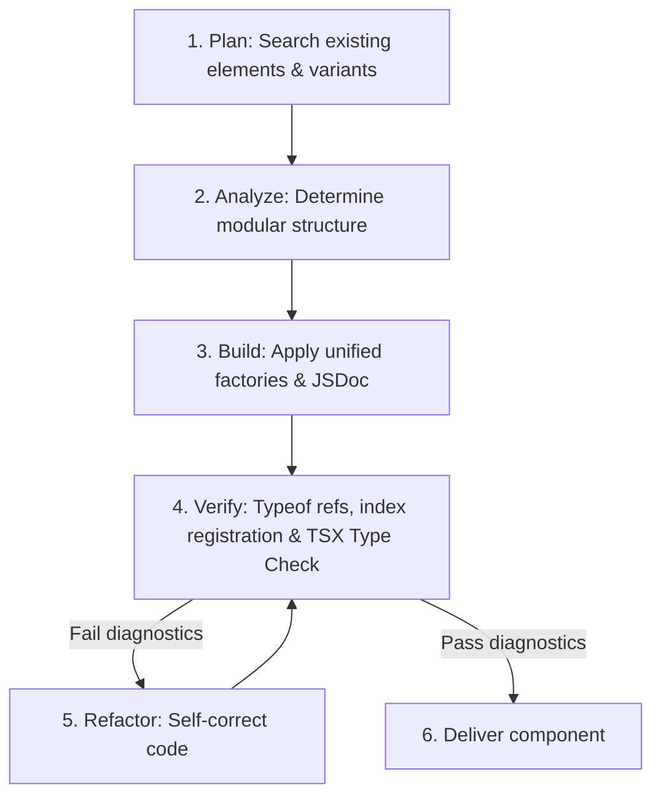

# Atomico Web Components Core Guide

Comprehensive reference for creating standard Custom Elements using Atomico's functional API.

## 1. The Core Pattern

```tsx
import { c, css, useProp, useListener } from "atomico";

/**
 * @component MyCounter
 * @see rules/component-creation.md - c(render, config) structure
 * @see rules/jsx-patterns.md - Composition using constructor tags
 */
export const MyCounter = c(
    ({ message }) => {
        /** @see rules/state-management.md - useProp for public reactive state */
        const [counter, setCounter] = useProp("counter");

        /** @see rules/hooks-api.md - useListener for clean DOM subscriptions */
        useListener({ current: window }, "resize", () => {
            console.log("Window resized! Current counter:", counter);
        });

        return (
            /** @see rules/styling-application.md - <host shadowDom> scopes styles */
            <host shadowDom>
                <h1>{message}</h1>
                <p>{counter}</p>
                {/* Event attributes use lowercase DOM casing exclusively */}
                <button onclick={() => setCounter((prev = 0) => prev + 1)}>
                    Add
                </button>
            </host>
        );
    },
    {
        /** @see rules/props-declaration.md - Props schema definition */
        props: {
            message: String, // Shorthand for read-only props without default states or reflection
            counter: { type: Number, value: () => 0, reflect: true } // Config object with arrow-function default factory
        },
        styles: css`
            :host { display: block; color: var(--color-base, blue); }
            :host([counter="0"]) { color: red; }
        `
    }
);
```

## 2. Core Validation Rules (Checklist for LLM Agents)

1. **Search-and-Variant-First (Component Reuse)**: Before creating any new component file or custom element, search the workspace for elements with a similar goal. If one is found:
   - Propose or automatically create a **variation** (e.g. via a `variant` prop or custom styling) instead of duplicating logic or files.
   - If the user/context allows automatic actions, execute it as a variation. If not, ask the user.
2. **Agnostic Registration**: Component declaration files (e.g. `my-button.tsx`) MUST only export the component instance. Do NOT call `customElements.define` inside the component file! Centralize all registration inside a components index file (`components/index.ts`) that imports the instances and registers them. This avoids naming collisions and grants consumer flexibility.
3. **Unified Property Factories**: When a property requires a default state, you MUST declare it using the configuration object and an arrow-function factory callback: `value: () => defaultValue`. Declaring raw static values (e.g., `value: ""` or `value: 0`) is incorrect. For simple read-only props without defaults or attribute reflection, use the simple shorthand type directly (e.g. `message: String`) to keep the code clean.
4. **Ref Typeof Inference**: For DOM references in hooks (like `useRef`), type the ref using the component constructor's native typeof: `useRef<typeof Component>()`. Do NOT use `any` or `InstanceType`.
5. **Root Element `<host>`**: Every render function MUST return a single `<host>` root element. Returning a `<div>`, `<Fragment>`, or other tag as the root is a fatal error.
6. **State Management**: Use `useProp` for values bound to properties or attributes that are accessible from the outside. Use `useState` strictly for isolated, private ephemeral toggles. For managing two or more related state parameters (like search fields, filters, tab sorting, active indices), you MUST group them using a single `useObjectState` hook to avoid state redundancy, unmaintainable dependency arrays, and excessive re-renders.
7. **Event Handler Casing**: Use strictly lowercase attributes for JSX event bindings (e.g., `onclick={...}`, `onchange={...}`). Do not use React-style camelCase (`onClick`).
8. **Prop Reflection for CSS Styling**: Use `reflect: true` exclusively when the objective is to control component styling and visual states using attribute-based CSS selectors on the host element (e.g. `:host([show]) { ... }` or `:host([disabled]) { ... }`). Prop reflection is restricted to simple serializable types (`String`, `Number`, `Boolean`); never reflect `Object` or `Array` types.
9. **JSX Composition**: Always compose child components using their exported constructor instances (e.g. `<MyChild />`) rather than string tag names (e.g. `<my-child />`) to inherit full TypeScript typings.
10. **Form-Friendly Custom Buttons**: In HTML forms, custom buttons inside Shadow DOM do not trigger parent form submits natively. If a custom button component is placed inside a `<form>` and needs to act as a submit trigger, it MUST use `form: true` in its configuration, obtain `ElementInternals` via `useInternals()`, and call `internals.form?.requestSubmit()` inside the click handler to delegate submission natively. Never stop click event propagation without handling form submission.
11. **Strict TypeScript Typing (Arrays & Objects)**: To prevent complex properties (such as `Array` or `Object`) from resolving to `never[]` or `{}` in TSX, you MUST use an explicit type assertion (e.g. `as Option[]` or `as Config`) inside the arrow-function default factory callback: `value: () => [] as Option[]`. Raw empty factories are strictly prohibited.
12. **Inline JSX Event Handlers & Native Event Propagation**: Unless shared by multiple elements, you MUST write event handlers inline directly inside the JSX attributes (e.g. `oninput={(e) => setValue(e.currentTarget.value)}`). This lets the compiler auto-infer the event and element types natively, eliminating manual `any` castings. NEVER capture and re-dispatch native bubbling events (such as duplicating `input` or `change` via `useEvent`), as this triggers double-propagation errors.


## 3. Directory Index

- `rules/component-creation.md`: Component declaration, agnostic export, and central index registration.
- `rules/jsx-patterns.md`: Using Constructors vs string tags.
- `rules/props-declaration.md`: Unified default factories, strict typeof refs, events, and callbacks.
- `rules/styling-application.md`: `<host shadowDom>` and CSS variables.
- `rules/state-management.md`: `useProp` vs `useState`.
- `examples/`: Reference implementations (Todo list, async suspense, slots, context, forms, DOM, abort controller).

## 4. API & Hooks Cheat Sheet

All React-equivalent hooks (`useState`, `useEffect`, `useLayoutEffect`, `useMemo`, `useCallback`, `useRef`, `useId`) have signatures and dependency-array semantics **exactly identical to React**.

### Core & Custom hooks
| API / Hook | Signature / Usage | Context & Rules | Reference Example |
| :--- | :--- | :--- | :--- |
| `c(render, config)` | `c((props) => JSX, config)` | Creates custom element constructor | [examples/1-generic.md](examples/1-generic.md) |
| `event<Detail>(opts?)` | `action: event<{ id: number }>({ bubbles: true })` | Inside `props` config. Generates event emitter | [examples/2-todo-app.md](examples/2-todo-app.md) |
| `callback<Fn>()` | `filter: callback<(val: string) => void>()` | Inside `props` config. Delegated logic returning values | [examples/2-todo-app.md](examples/2-todo-app.md) |
| `css` | `css` :host { ... }`` | Tagged template literal for scoped shadow CSS | [examples/1-generic.md](examples/1-generic.md) |
| `useProp(name)` | `[val, setVal] = useProp<T>("propName")` | Linked to declared prop. Throws runtime error if missing from config | [examples/1-generic.md](examples/1-generic.md) |
| `useHost()` | `host = useHost()` | Returns `{ current: HTMLElement }` instance reference | [examples/6-other-hooks.md](examples/6-other-hooks.md) |
| `useEvent(name, opts)` | `dispatch = useEvent<Detail>(name, opts)` | Dispatches `CustomEvent`. Defaults to event prop if declared | [examples/2-todo-app.md](examples/2-todo-app.md) |
| `useUpdate()` | `update = useUpdate()` | Manually triggers component re-render | [examples/6-other-hooks.md](examples/6-other-hooks.md) |
| `useListener(ref, type, cb, opts?)` | `useListener(ref, "click", (e) => {})` | Subscribes listener to ref'd element; auto-cleans on unmount | [examples/6-other-hooks.md](examples/6-other-hooks.md) |
| `useState(init)` | `[state, setState] = useState(init)` | 🔄 Identical to React. For single isolated private states only | [examples/1-generic.md](examples/1-generic.md) |
| `useObjectState(init)` | `[state, setState] = useObjectState(init)` | 📦 Grouped related states. Supports partial updates & eliminates useState redundancy | [rules/state-management.md](rules/state-management.md) |
| `useCallback(fn, deps)` | `cb = useCallback(fn, deps)` | 🔄 Identical to React. Caches callback reference | [examples/6-other-hooks.md](examples/6-other-hooks.md) |
| `useMemo(fn, deps)` | `val = useMemo(fn, deps)` | 🔄 Identical to React. Caches calculated value | [examples/6-other-hooks.md](examples/6-other-hooks.md) |
| `useEffect(fn, deps)` | `useEffect(() => cleanup, deps)` | 🔄 Identical to React. Triggers async after paint | [examples/6-other-hooks.md](examples/6-other-hooks.md) |

### Async & Suspension hooks
| Hook | Signature | Behavior | Reference Example |
| :--- | :--- | :--- | :--- |
| `usePromise(cb, deps?, run?)` | `promise = usePromise(asyncFn, [id])` | Tracks async lifecycle: returns `{ result, pending, fulfilled, rejected }` | [examples/3-async-suspense.md](examples/3-async-suspense.md) |
| `useAsync(cb, deps)` | `result = useAsync(asyncFn, [id])` | Suspends rendering until promise resolves. Requires `useSuspense` parent | [examples/3-async-suspense.md](examples/3-async-suspense.md) |
| `useSuspense(fps?)` | `status = useSuspense()` | Aggregate loader boundary. Subtree `useAsync` calls propagate to it | [examples/3-async-suspense.md](examples/3-async-suspense.md) |
| `useAbortController(deps)` | `controller = useAbortController(deps)` | Auto-aborted on dependency change or component unmount | [examples/9-abort-controller.md](examples/9-abort-controller.md) |

### DOM & Context hooks
| Hook | Signature | Behavior | Reference Example |
| :--- | :--- | :--- | :--- |
| `useSlot(ref, filter?)` | `slots = useSlot(ref, el => el instanceof MyItem)` | Tracks assigned elements inside `<slot>` | [examples/8-advanced-dom.md](examples/8-advanced-dom.md) |
| `useNodes(filter?)` | `nodes = useNodes(el => el instanceof Element)` | Direct Light DOM children observer via MutationObserver | [examples/8-advanced-dom.md](examples/8-advanced-dom.md) |
| `useParent(target, cross?)` | `formRef = useParent("form", true)` | Traverses ancestors. Set `cross=true` to cross shadow boundary | [examples/8-advanced-dom.md](examples/8-advanced-dom.md) |
| `useRender(view, deps)` | `useRender(() => <button>Light DOM</button>)` | Renders VNode directly into the Light DOM | [examples/8-advanced-dom.md](examples/8-advanced-dom.md) |

### Form-Associated hooks
*Required `form: true` in component configuration.*
| Hook | Signature | Behavior | Reference Example |
| :--- | :--- | :--- | :--- |
| `useInternals()` | `internals = useInternals()` | Direct access to the native `ElementInternals` instance | [examples/7-form-association.md](examples/7-form-association.md) |
| `useFormProps()` | `[val, setVal] = useFormProps()` | Auto-syncs `name` & `value` properties with `FormData` | [examples/7-form-association.md](examples/7-form-association.md) |
| `useFormValidity(cb, deps)` | `[msg, validity] = useFormValidity(check, deps)` | Integrates native browser constraint validation | [examples/7-form-association.md](examples/7-form-association.md) |

## 5. Development & Verification Pipeline (The Sandbox Flow)

To match premium quality standards, every AI Agent MUST follow this validation pipeline when developing or refactoring Atomico components:



### Steps Description:
1. **Plan & Search**: Query the workspace for components with similar goals to check for potential styling variants (`variant`) or component variations, rather than coding from scratch.
2. **Analyze**: Determine the modular component tree. High complexity views must place child components under `components/` and import them.
3. **Build**: Write the custom element exporting only the component instance. Use arrow-function factories (`value: () => defaultValue`) for all property defaults.
4. **Verify & Register**:
   - Register all component instances in a central index (`components/index.ts`).
   - Type DOM references using the `useRef<typeof Component>()` pattern.
   - **TSX Type Check**: Explicitly run type checking (e.g. `tsc --noEmit` or verify TS compiler outputs) to ensure that all properties (especially `Array` and `Object` properties with custom type assertions) compile flawlessly without type errors (`never[]`).

---

## 6. Multi-Agent Pipeline Protocol (Specialized Delegation)

For high-complexity views, dashboards, or applications, the main agent MUST NOT write all components directly in a single context. Instead, delegate sub-tasks to specialized subagents to guarantee attention focus and strict compliance.

### A. Component Architect Subagent (`component-architect`)
*   **Trigger**: At the beginning of a complex view creation or refactoring.
*   **Role**: Analyzes layout composition and existing workspace elements.
*   **Instruction**: Define and invoke this subagent to plan the component tree structure under `./components/` using the `Search-and-Variant-First` paradigm. It yields the list of necessary files and their property definitions, keeping the workspace tidy.

### B. TypeScript & Quality Guard Subagent (`typescript-guard`)
*   **Trigger**: Once components are written, before final delivery.
*   **Role**: Enforces strict typing, code styling, and runs type-check verifications.
*   **Instruction**: Define and invoke this subagent to verify the written code. It MUST:
    1. Scan the components for any `any` type overrides, raw parameter typings in inline handlers (e.g., `(e: Event)` in `oninput`), or redundant state managers (`useState` where `useObjectState` should be used).
    2. Run type compilation checks (`tsc --noEmit`) to ensure strict compliance.
    3. Return a clean approval status or refactor files directly to resolve any validation discrepancies.


